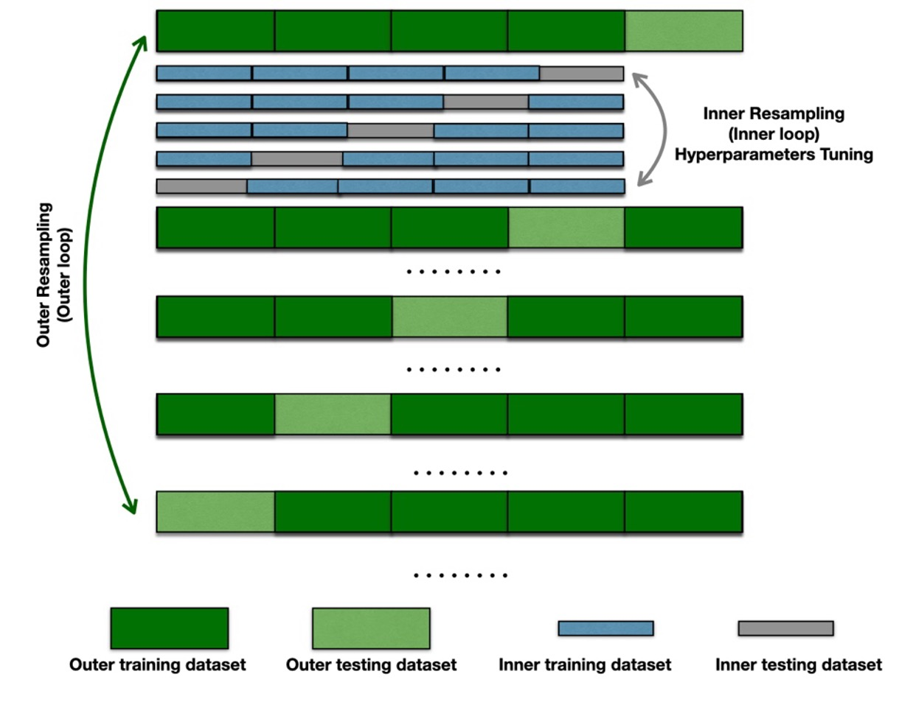

# Frailty-Prediction-EHR
EHR-based frailty prediction using machine learning

In this study, we created machine learning models to predict frailty against Fred Frailty Phenotype (treated as ground truth) in pre-operative settings for older adults (aged 65 and above) using patients' electronic health records (EHR). 

We built two types of models: 
  - A comprehensive model including all surgical services that patients in our cohort underwent.
  - Separate machine learning models specifically for each surgical service that had more than 400 patients (e.g., Urology and Thoracic and Cardiac Surgery).
 
We also constructed the Rockwood frailty index following the accumulation of deficits approach using 34 chosen health deficits. We then compared the performance of predicting frailty phenotype using 1) machine learning and 2) Rockwood frailty index.

# Structure of the repository
  - KNN Imputation: codes for the implementation of the pipeline with KNN imputation
  - Mean Imputation: codes for the implementation of the pipeline with mean imputation
  - Median Imputation: codes for the implementation of the pipeline with Median imputation
  - No Imputation: codes for the implementation of the pipeline with no imputation on numerical features, but let XGBoost deal with missing values internally.
  - Utils: codes for comparing the performance of machine learning models and Rockwood frailty index, model interpretation using SHapley Additive exPlanations (SHAP), and generating the heatmap for feature importance across surgical services.

# Machine learning model development

## Data & Data preprocessing
Features (pre-operative features) included patient characteristics that were available up to 6 months before their frailty assessment: 
  - Sociodemographic (e.g., age, gender, race, and education level).
  - Medical history and acuity (e.g., history of cancer, and American Society of Anesthesiologists (ASA) physical status score).
  - The most recent biochemical measurements that are commonly measured in pre-operative clinics (e.g., hemoglobin and hematocrit).

We mapped the original International Statistical Classification of Diseases and Related Health Problems, Tenth Revision (ICD-10) diagnosis codes to the Clinical Classifications Software (CCS) categories. Medical conditions (CCS categories) that appeared in at least 10% of the cohort were selected and used as potential features in the ML models.

We compared three data imputation methods 1) mean imputation, 2) median imputaiton, and 3) K-nearest neighbors (KNN) imputations in imputing the missing values for numerical features together with the internal misisng value handling mechnism of XGBoost. Categorical features were imputed by creating a new category as "unknonwn".

Numerical features were scaled to range between 0 and 1. Categorical features were encoded to be from 1 to K (number of categories).

## Machine learning model development 
We applied eXtreme Gradient Boosting (XGBoost) to build the machine learning models. To overcome data imbalance, the weights of the minority class were set to be the ratio between the number of non-frail patients and frail patients for each surgical service. 

## Machine learning model performance & evaluation
To evaluate our ML models, we used nested cross-validation with five outer folds and five inner folds (5x5 nested-CV).

  Overview of nested crossvalidation
  

#### Pseudocode of Nested crossvalidation 
Nested 5x5 Cross-Validation in our study
1.	Define set of hyper-parameter combinations, **C**, for XGBoost.
2.	Divide data into 5 folds (data will be distributed into each unique fold)
3.	(**outer loop**) For fold i (from 1 to 5) in the 5 folds:
     
    a.	Set data from i-th fold as test set
     
    b.	Build machine learning models and fine-tune hyperparameters on the remaining 4 folds 
     
    c.	For hyperparameter combination c in **C**:
     
    &nbsp;&nbsp;&nbsp;&nbsp;&nbsp;&nbsp;&nbsp;&nbsp;i.	(**inner loop**) Split data from the remaining 4 folds into 5 inner folds 
     
    &nbsp;&nbsp;&nbsp;&nbsp;&nbsp;&nbsp;&nbsp;&nbsp;&nbsp;&nbsp;&nbsp;&nbsp;&nbsp;&nbsp;&nbsp;&nbsp;1.	Set inner fold j (from 1 to 5) as validation set (validation set contains data from 3 participants)
     
    &nbsp;&nbsp;&nbsp;&nbsp;&nbsp;&nbsp;&nbsp;&nbsp;&nbsp;&nbsp;&nbsp;&nbsp;&nbsp;&nbsp;&nbsp;&nbsp;2.	Train model on the remaining 5 inner folds 
     
    &nbsp;&nbsp;&nbsp;&nbsp;&nbsp;&nbsp;&nbsp;&nbsp;&nbsp;&nbsp;&nbsp;&nbsp;&nbsp;&nbsp;&nbsp;&nbsp;3.	Evaluate model performance on inner fold j
     
    &nbsp;&nbsp;&nbsp;&nbsp;&nbsp;&nbsp;&nbsp;&nbsp;ii.	Calculate average performance over five inner folds for each parameter combination c
     
    d.	Train model on the remaining 4 folds using hyperparameter combination that yielded best average performance over all steps of the inner loop
    e.	Evaluate model performance on outer fold i
4.	Calculate average performance over 5 outer folds
